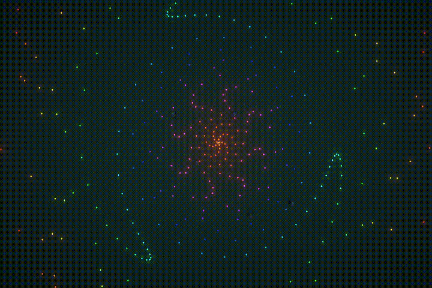
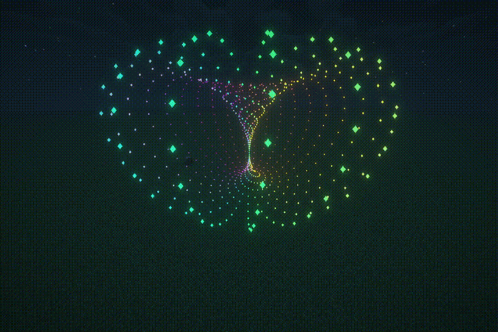

# KParticle

[![Contributors][contributors-shield]][contributors-url]
[![Forks][forks-shield]][forks-url]
[![Stargazers][stars-shield]][stars-url]
[![Issues][issues-shield]][issues-url]
[![AGPLv3 License][license-shield]][license-url]

### **简洁·定制·数学**

一个让你可以“**在Minecraft里玩[Desmos](https://www.desmos.com/)**”的Fabric粒子模组。
<!--[项目文档](https://cromemadnd.cn/) WIP-->

> 境符「波と粒の境界」

```mcfunction
kparticle ~ ~5 ~ {pos:["100*(c-p)*cos(2000*p^1.5)","0","100*(c-p)*sin(2000*p^1.5)"],scale:"0.25",lifetime:"300*p+300",color:["3p%1","1","1"],hsv:true,alpha:"if(c-p, 1, 0)"} 1000 @a
```

## 目录

- [介绍](#介绍)
    - [高度定制](#高度定制)
    - [自由控制](#自由控制)
    - [服务器友好](#服务器友好)
- [贡献](#贡献)
  - [贡献者](#贡献者)
  - [如何参与](#如何参与)
  - [List\<TODO> (供参考)](#listtodo-供参考)
- [版权说明](#版权说明)
- [鸣谢](#鸣谢)


## 介绍

### 高度定制

通过KParticle，你可以把粒子的*xyz（坐标）、rgb（颜色）、透明度、亮度、大小、动画帧*全部写成时间的参数方程。

同样地，它也支持导入你自己的粒子贴图。


```mcfunction
kparticle ~ ~5 ~ {lifetime:"300",pos:["(sin(8*pi*c+50*pi*p)+1)*5*cos(2*pi*p+5*pi*c)","cos(2*pi*c+50*pi*p)*5","(sin(8*pi*c+50*pi*p)+1)*5*sin(2*pi*p+5*pi*c)"],scale:"0.1",color:["p","(sin(c*pi*8+p*20)+1)/4 + 0.5","(sin(c)+1)/2"],hsv:true,alpha:"4-4c",frame:"0"} 720 @a
```

### 自由控制

通过将粒子分组，你可以**随时修改**一组已存在粒子的各项属性（贴图除外）。

通过对*粒子当前时间、时间流逝速度与存续时间*的自由修改，你可以很方便地做出复杂的粒子动画。

KParticle支持动态参数[^1]，这意味着你可以将粒子属性与游戏世界绑定。


```mcfunction
# 循环，每tick执行
data modify storage kparticle phi set from entity @p Rotation[0]
data modify storage kparticle theta set from entity @p Rotation[1]
data modify storage kparticle posx set from entity @p Pos[0]
data modify storage kparticle posy set from entity @p Pos[1]
data modify storage kparticle posz set from entity @p Pos[2]
ksync @a

# 执行一次（命令超长警告）
kparticle 0.0 1.65 0.0 {pos:["{posx}-n/5*cos({theta}/180*pi)sin({phi}/180*pi)-(sin({phi}/180*pi)sin({theta}/180*pi)cos(t+n)+cos({phi}/180*pi)sin(t+n))","{posy}-n/5*sin({theta}/180*pi)+cos({theta}/180*pi)cos(t+n)","{posz}+n/5*cos({theta}/180*pi)cos({phi}/180*pi)+(cos({phi}/180*pi)sin({theta}/180*pi)cos(t+n)-sin({phi}/180*pi)sin(t+n))"],lifetime:"inf",color:["1-2p","1-2abs(p-.5)","2p-1"]} 200 @a
```

### 服务器友好

KParticle的所有计算与渲染工作都在客户端进行，服务器端仅处理命令、进行数据包广播与NBT属性同步。

并且，生成粒子、清除粒子、更改粒子属性、变量同步的广播信息都可以指定玩家发送。


```mcfunction
# 改变亮度与大小
kgroup default merge {brightness:"7.5+7.5sin(t+n/2)", scale:"0.2+0.1sin(2t+n/4)"} @a
# 时停
kgroup default merge {timescale:"0"} @a
# 倒·快放
kgroup default merge {timescale:"-2"} @a
# 慢放
kgroup default merge {timescale:"0.5"} @a
# 清除
kgroup default clear @a
```


## 贡献

### 贡献者
- Cromemadnd ([cromemadnd@cromemadnd.cn](mailto://cromemadnd@cromemadnd.cn))

### 如何参与
> 由于本人程序能力有限且缺乏开源项目经验，本项目存在诸多缺陷。**非常感谢**你所能做的一切贡献。
1. Fork the Project
2. Create your Feature Branch (`git checkout -b feature/AmazingFeature`)
3. Commit your Changes (`git commit -m 'Add some AmazingFeature'`)
4. Push to the Branch (`git push origin feature/AmazingFeature`)
5. Open a Pull Request

### List\<TODO> (供参考)
1. 为pos参数添加球坐标系与柱坐标系支持，以简化指令
2. 为动态参数（即NBT变量）处理部分代码进行优化（目前处理动态参数的性能开销非常大）
3. 修复偶发的渲染卡顿问题
4. 优化…总之就是优化。


## 版权说明
本项目使用AGPL-3.0协议开源，详情请参阅[LICENSE][license-url]。

## 鸣谢
- 使用了[exp4j](https://github.com/fasseg/exp4j)进行表达式解析。
- 功能设计参考了[ColorBlock](https://github.com/IslenautsGK/ColorBlock)与[MadParticle](https://github.com/USS-Shenzhou/MadParticle)。
- 使用了[DeepSeek](https://chat.deepseek.com/)辅助编程。
- 本README以[Best README template](https://github.com/shaojintian/Best_README_template)为模板编写。

<!-- links -->
[contributors-shield]: https://img.shields.io/github/contributors/cromemadnd/kparticle.svg?style=flat-square
[contributors-url]: https://github.com/cromemadnd/kparticle/graphs/contributors
[forks-shield]: https://img.shields.io/github/forks/cromemadnd/kparticle.svg?style=flat-square
[forks-url]: https://github.com/cromemadnd/kparticle/network/members
[stars-shield]: https://img.shields.io/github/stars/cromemadnd/kparticle.svg?style=flat-square
[stars-url]: https://github.com/cromemadnd/kparticle/stargazers
[issues-shield]: https://img.shields.io/github/issues/cromemadnd/kparticle.svg?style=flat-square
[issues-url]: https://github.com/Cromemadnd/kparticle/issues
[license-shield]: https://img.shields.io/github/license/cromemadnd/kparticle.svg?style=flat-square
[license-url]: https://github.com/cromemadnd/kparticle/blob/master/LICENSE